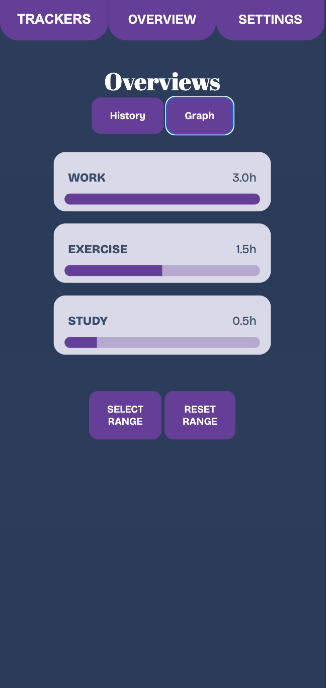
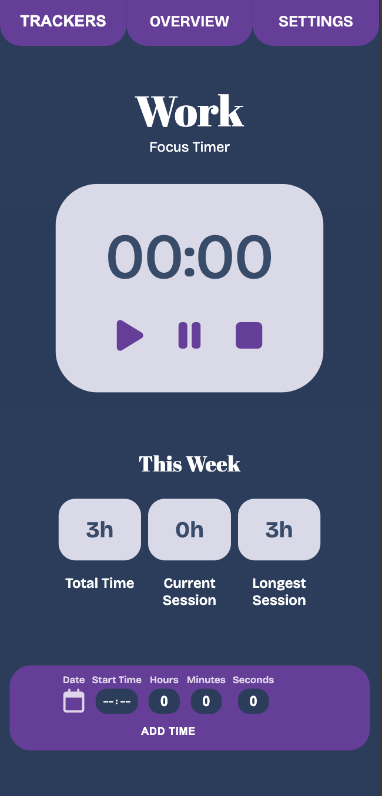
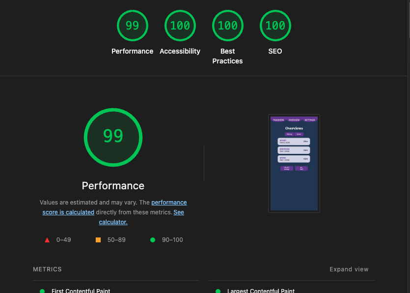

## Timelog App

A small, client-side time-tracking web application built with plain HTML, CSS and JavaScript.

It contains an overview page, work mode, training mode, a timer, a simple add-time UI, charts, themes, and offline support via a service worker.

## CI / CD

This project uses GitHub Actions for continuous integration and delivery. The workflows run the Jest test suite (with coverage) on pushes and pull requests and upload coverage reports to Codecov.

## Features

- Add and log time entries
- Overview dashboard with summaries and charts
- Work / Training modes and Pomodoro mode
- Themes for light/dark styles
- Unit tests with Jest and coverage thresholds
- Offline support (service worker)

## Screenshots

Overview page

Work page

Lighthouse Score

## Project structure (important files)

- `html/` — application pages (overview, work mode, training mode, settings, etc.)
- `scripts/` — core JavaScript logic (timer, overviewLogic, barchartLogic, themes, service worker registration, DOM helpers)
- `css/` — styles (components, variables, layout)
- `images/` — screenshots and visual assets (referenced by the README and pages)
- `coverage/` — generated coverage reports after running tests
- `*.tests/` — Jest unit tests (e.g. `timer.test.js`, `barchart.test.js`, `overviewLogic.test.js`, …)
- `.github/workflows/` — CI workflows (GitHub Actions)
- `package.json` — npm scripts and Jest configuration
- `eslint.config.mjs` — ESLint configuration
- `readme.md` — this file

Note: `node_modules/` is not checked into source control and is generated by `npm install`.

## Requirements

- Node.js (for running tests with Jest)
- A static file server to serve the `html/` pages (optional — you can also open the HTML files directly in the browser)

## Install & run tests

1. Install dev dependencies:

   npm install

2. Run the test suite with coverage:

   npm test

Other useful npm scripts:

- `npm run test:watch` — run Jest in watch mode
- `npm run test:coverage` — run tests and produce coverage report
- `npm run lint` — run ESLint (project root)

## Tests & Coverage

- Jest is configured in `package.json` and set to collect coverage for `scripts/**/*.js` (some DOM files are excluded).
- Coverage thresholds are defined in `package.json` under `jest.coverageThreshold`.
- A coverage report is generated in the `coverage/` folder after tests run.

## What we have learned

- The importance of unit testing and test coverage in software development.
- How to use Jest for testing JavaScript applications.
- Best practices for organizing tests and using mocks.
- JavaScript and DOM manipulation testing techniques.
- The value of CI pipelines for maintaining code quality and preventing regressions.
- The basics of service workers for offline support in web applications.
